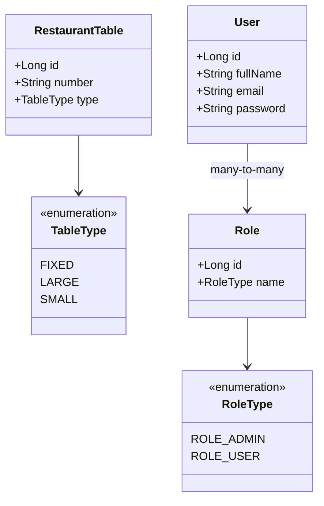

# Restaurant Reservation System
REST API for managing tables and reservations for a restaurant.  
Backend project developed with **Java 17**, **Spring Boot 4.0** and **PostgreSQL**.

## ✨ Iteration Plan
- Iteration 1 (branch `feature/auth-admin-operations`): Functional restaurant table administration panel
- Iteration 2 (branch `feature/jwt-auth`): JWT authentication and role-based access control (ADMIN/USER)
- Iteration 3 (branch `feature/crud-reservations`): Reservation CRUD with availability and locking strategies
- Iteration 4 (branch `feature/email-oauth2`): OAuth2 (Google/GitHub) and email notifications via AWS SES
  **Current status:** Iteration 2 in progress
- 
## 🛠️ Technologies
- Java 17
- Spring Boot 4.0.x
- Spring Data JPA
- PostgreSQL 16
- H2 (tests only)
- Lombok
- SpringDoc OpenAPI 2.6
- Maven
- Docker / Docker Compose
- Spring Security
- JJWT (Java JWT)

## 🚀 How to run locally
### Prerequisites
- JDK 17
- Maven (included `./mvnw`)
- Docker and Docker Compose
### Step 1: Start PostgreSQL
```bash
docker compose up -d
```
The `table-reservations` database will be available at `localhost:5432` (user: `postgres`, password: `postgres`).

### Step 2: Run the application
```bash
./mvnw spring-boot:run -Dspring-boot.run.profiles=dev
```

The API will be listening at `http://localhost:8080`.

## 🧪 Running the tests
```bash
./mvnw test
```

Unit and integration tests use an in-memory H2 database and do not require PostgreSQL.

## 📚 API Documentation
Once the application is running, you can access:

- **Swagger UI:** [http://localhost:8080/swagger-ui.html](http://localhost:8080/swagger-ui.html)
- **OpenAPI specification (JSON):** [http://localhost:8080/api-docs](http://localhost:8080/api-docs)

### Available endpoints

| Method | Endpoint | Description | Permissions |
| --- | --- | --- | --- |
| `POST` | `/api/tables/initialize` | Initializes restaurant tables | ADMIN (pending) |
| `GET` | `/api/tables` | Gets the current table configuration | ADMIN (pending) |
| `POST` | `/api/auth/signup` | Registers a new user with ROLE_USER role | Public |
| `POST` | `/api/auth/signin` | Log in and returns a JWT | Public |

### Authentication

The API uses JWT Bearer tokens. To authenticate:

1. Use `POST /api/auth/signin` with seeded credentials or sign up first.
2. Copy the returned token from the response.
3. In Swagger UI, click **Authorize** and paste `Bearer <token>`.
4. Now you can access protected endpoints.

For development and test profiles, two users get created:
- admin@admin.com / admin (ROLE_ADMIN)
- user@user.com / user (ROLE_USER)

## 📦 CI/CD

GitHub Actions is configured to compile and run tests automatically on every push to `develop` and `feature/*` branches.  
*(Railway deployment will be added in iteration 2)*

## 📐 Class diagram (simplified)



## GIT Policy

This project follows [Conventional Commits](https://www.conventionalcommits.org/en/v1.0.0/) for commit messages.  
Main branches: `main`, `develop`.  
Development is done on `feature/*` branches.